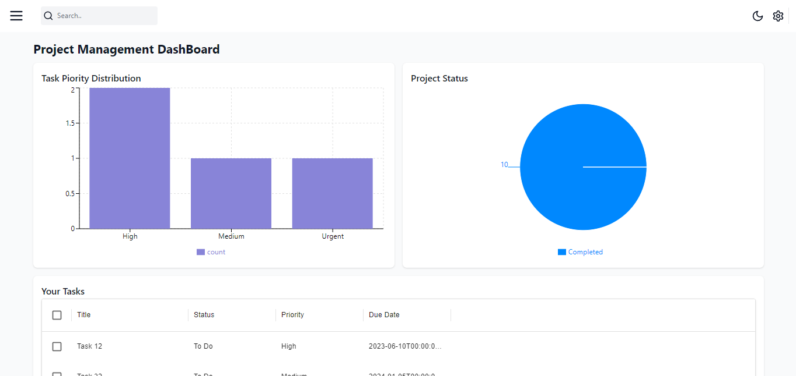

# Dashboard of management tasks

<p align="center">
	
	
	
</p>

___

<br>

## 🔗 Sumário

- [📍 Sobre](#-sobre)
- [⌛ Melhorias futuras](#-melhorias-futuras)
- [👾 Funcionalidades](#-funcionalidades)
- [💻 Tecnologias](#-tecnologias)
- [📁 Estrutura do projeto](#-estrutura-do-projeto)
- [🚀 Início](#-início)
  - [📝 Pré-requisitos](#-pré-requisitos)
  - [🔧 Instalação](#-instalação)
  - [🤖 Como usar](#-como-usar)

---
## 📍 Sobre

Management task é um sistema de gerenciamento de projetos e tarefas, no qual o usuário pode criar times, incluir pessoas em times e criar tarefas personalizadas para os membros do projeto.

---

## 📌 Melhorias futuras
O projeto ainda está em desenvolvimento e as próximas atualizações serão focadas nos seguintes aspectos:

- [ ] **`Task 1`**: Integrar todas as rotas da API;
- [ ] **`Task 2`**: Registro de usuários
- [ ] **`Task 3`**: Sistema de login.
- [ ] **`Task 3`**: Deploy do projeto.

---
## 👾 Funcionalidades

<ul>
 <li>Criar, editar e deletar projetos</li>
 <li>Pesquisar por projetos e tasks</li>
 <li>Filtrar tasks por prioridades</li>
 <li>Visualizar users</li>
 <li>Visualizar times</li>
 <li>Adicionar pessoas a times</li>
 <li>Criar, editar e deletar tasks</li>
 <li>Atribuir tasks a usuários</li>
</ul>

## 💻 Tecnologias

- **Frontend**: Next.js, Tailwind CSS, Redux Toolkit, Redux Toolkit Query, Material UI Data Grid
 - **Backend**: Node.js with Express, Prisma (PostgreSQL ORM);
 - **DataBase**: PostgreSql, managed with pgAdmin;
---

## 📁 Estrutura do Projeto

```sh
└── Management-tasks.git/
    ├── README.md
    ├── client
    │   ├── .env.local
    │   ├── .eslintrc.json
    │   ├── .gitignore
    │   ├── .prettierrc
    │   ├── README.md
    │   ├── app
    │   ├── components
    │   ├── next.config.mjs
    │   ├── package-lock.json
    │   ├── package.json
    │   ├── postcss.config.mjs
    │   ├── public
    │   ├── state
    │   ├── tailwind.config.ts
    │   └── tsconfig.json
    └── server
        ├── .env
        ├── .gitignore
        ├── client.http
        ├── dist
        ├── package-lock.json
        ├── package.json
        ├── prisma
        ├── src
        └── tsconfig.json
```
---
## 🚀 Início

### 📝 Pré-requisitos
Antes de iniciar o projeto é necessário que você atenda aos seguintes pré requisitos:

- Ter o <a href="https://nodejs.org/en">Node.js</a> instalado na máquina. 
- Ter algum gerenciador de pacotes para o Nodejs. Recomendo o <a href="https://www.npmjs.com/">NPM</a>.
- Recomedável ter instalado algum editor de código, como o <a href="https://code.visualstudio.com/">VS Code</a>

### 🔧 Instalação

Passo a passo para instalar e usar o projeto:

1. Clone o repositório para sua máquina
```sh
❯ git clone https://github.com/Albert1616/Management-tasks.git
```

2. Navegue até a pasta raiz do projeto:
```sh
❯ cd Management-tasks
```

3. Instale as dependências de desenvolvimento e defina as variávies de ambiente para o client e o server:
**Using `npm`** &nbsp; [](https://www.npmjs.com/)
	<b>Client</b>: 
	- Acesse a pasta client
	```sh
	❯ cd client
	```
	- Instale as dependências de desenvolvimento
	```sh
	❯ npm install
	```
	- Crie na pasta raiz do server o arquivo ```.env.local```, onde irão ser definidas as variáveis de ambiente.
	</br>
	- Crie dentro do arquivo ```.env.local``` as variávies: ```NEXT_PUBLIC_API_BASE_URL = http://localhost:PORT```, em que PORT é a porta na qual o server estará em execução.

	<b>Server</b>:

	- Acesse a pasta server
	```sh
	❯ cd server
	```

	- Instale as dependências de desenvolvimento
	```sh
	❯ npm install
	```
	
	- Crie na pasta raiz do server o arquivo ```.env```, onde irão ser definidas as variáveis de ambiente.
	</br>
	- Crie dentro do arquivo ```.env``` as variávies: ```DATABASE_URL``` e ```PORT```, que são respectivamente a url de conexão com o banco de dados,consulte o <a href="https://www.prisma.io/docs/orm/overview/databases">prisma databases</a> para saber o padrão da sua url dependendo do banco de dados que você irá utilizar, e a porta na qual o projeto será executado, por padrão 8000.
	</br>
	- Para conectar o primsa ORM ao banco de dados execute o comando:
	```sh
	npx prisma migrate dev name --init
	```
	- Agora execute o seguinte comando para inserir registros ficticios no banco de dados: 
	```sh
	npm run seed
	```
<!-- **Using `docker`** &nbsp; [](https://www.docker.com/)

```sh
❯ docker build -t Albert1616/Management-tasks.git .
``` -->


### 🤖 Como usar
Para executar o projeto siga os seguintes passos no ````/server```` e ```/client``` :
</br>
**Using `npm`** &nbsp; [](https://www.npmjs.com/)

<b>Server</b>:
Dentro da pasta /server execute o comando:

```sh
❯ npm run dev
```
<b>Client</b>:
Dentro da pasta /client e após iniciar o servidor, execute o comando:
```sh
❯ npm run dev
```

